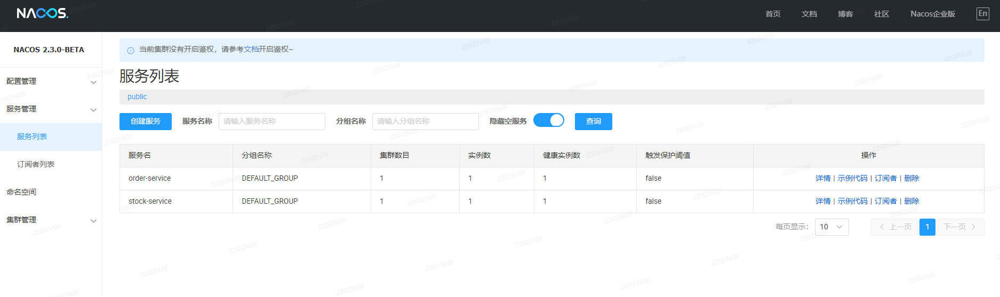
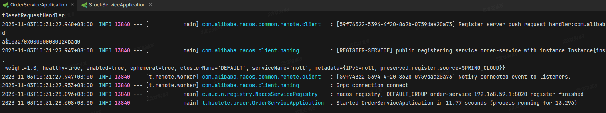
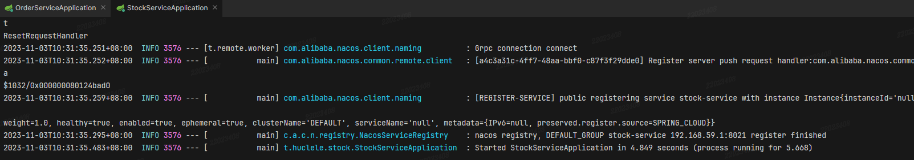
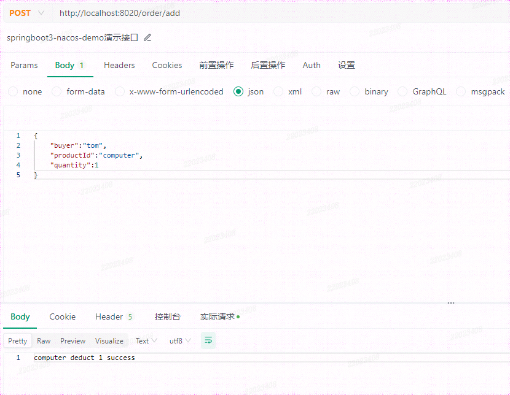

## Demo演示项目

> Springboot 3.x 集成 SpringCloud 2022.0.4、SpringCloudAlibaba 2022.0.0.0

### 演示业务背景

订单新增，扣减锁定产品的存量

### 相关组件版本

截止2023/11/3 均为最新版本

JDK Version ： 17

Nacos Server 版本： 2.3.0-BETA



SpringBoot Parent 版本：3.1.5

Nacos Client 版本： 2.3.0-BETA

SpringCloud 版本： 2022.0.4

SpringCloudAlibaba 版本： 2022.0.0.0

### 集成说明

父工程，完成依赖引入

1. 添加SpringCloud、SpringCloudAlibaba 相关依赖

```xml
<dependencyManagement>
    <dependencies>
        <dependency>
            <groupId>org.springframework.cloud</groupId>
            <artifactId>spring-cloud-dependencies</artifactId>
            <version>${spring-cloud-dependencies.version}</version>
            <type>pom</type>
            <scope>import</scope>
        </dependency>
        <dependency>
            <groupId>com.alibaba.cloud</groupId>
            <artifactId>spring-cloud-alibaba-dependencies</artifactId>
            <version>${spring-cloud-alibaba-dependencies.version}</version>
            <type>pom</type>
            <scope>import</scope>
        </dependency>
    </dependencies>
</dependencyManagement>
```

2. 添加服务发现依赖

```xml
<dependency>
    <groupId>com.alibaba.cloud</groupId>
    <artifactId>spring-cloud-starter-alibaba-nacos-discovery</artifactId>
    <exclusions>
        <exclusion>
            <groupId>com.alibaba.nacos</groupId>
            <artifactId>nacos-client</artifactId>
        </exclusion>
    </exclusions>
</dependency>

<dependency>
    <groupId>com.alibaba.nacos</groupId>
    <artifactId>nacos-client</artifactId>
    <version>2.3.0-BETA</version>
</dependency>

<dependency>
    <groupId>org.springframework.cloud</groupId>
    <artifactId>spring-cloud-starter-loadbalancer</artifactId>
</dependency>
```

3. 添加其余相关演示依赖

### 运行演示







### 强调说明

Springboot 3.x 支持最小JDK版本为17

Nacos Server 2.3.0 需要对应版本的客户端引入，最新版SpringCloudAlibaba Discovery 引入版本落后，需自行引入

SpringCloud 2022.x.x 不再支持默认Netflix 相关依赖引入，官方推荐采用spring-cloud-starter-loadbalancer 完成服务发现拦截器的处理